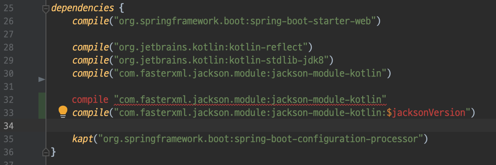
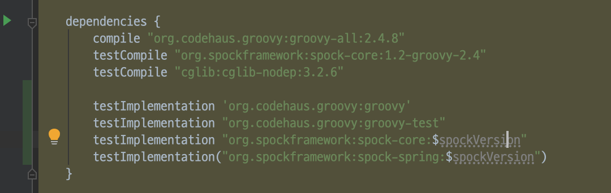

= Gradle Kotlin DSL 이야기
jiheon.kim, jiheon.kim@woowahan.com
v0.0.1, 2019-04-30
// :toc: left
// :toclevel: 4

//placeholder
:kt: 코틀린

[quote#honeymon, #월급쟁이개발자 허니몬]
____
Developer life is **Coding** between **Build** and **Deploy**.

개발자 인생은 (프로젝트) 빌드와 배포 사이 삽질(=코딩)이다.
____

//서론
[[build-tool]]
== 빌드도구(Build tool) 이야기

새로운 프로젝트를 시작하는 단계에서 

* 어떤 **프로그래밍 언어**를 사용할 것인가?
* 어떤 **플랫폼**에서 개발할 것인가?
* 어떤 **빌드도구**를 사용할 것인가?
* 어떤 **버전관리 시스템**을 사용할 것인가?
* 어떤 **빌드배포 시스템**을 사용할 것인가?

등의 고민을 하게 된다. 이 고민 중에서 누구나 흔하게 접하고 매일매일 사용하고 있는 **빌드도구**, 그 중에서 **그레이들(Gradle)**, 거기서 더 들어가 **Gradle Kotlin DSL**에 대한 이야기를 하려고 한다.

[NOTE]
====
'스프링 부트'를 사용하면 이런 고민을 줄일 수 있다. 어디까지나 고민을 줄일 수 있다는 것이지 없앨 수 있는 것은 아니다(Spring initializr 에서 생성하면 `.gitignore` 파일도 함께 포함시켜주니 고민없이 깃(git)을 버전관리 시스템으로 선택할 수 있다). 

손 안대고 코플면 옷에 묻을 수도 있다. 
====

=== 빌드도구란 무엇인가?
빌드도구(link:https://en.wikipedia.org/wiki/List_of_build_automation_software[])에 대해서 어떻게 설명하면 좋을까 고민하며 인터넷 검색을 하다가 마음에 드는 것을 찾았다.

[NOTE]
====
* link:https://stackoverflow.com/questions/7249871/what-is-a-build-tool[]

> '빌드도구'는 소스코드를 자동으로 실행가능한 애플리케이션 생성물을 만드는 프로그램이다. 빌드과정은 소스코드를 컴파일하고 연결하고 패키징하여 실행가능한 형태로 가공한다.
====

그리고 기본적인 **빌드 자동화(Build automation)**의 개념에 대해 이야기 한다.

* 의존성 라이브러리 다운로드
* 컴파일: 소스코드 -> 바이너리코드
* 테스트 실행
* 바이너리코드 패키징
* 운영시스템 배포

빌드도구는 말그대로 프로젝트를 배포가능한 상태로 생성하는 '마법같은 도구'다. 크흡.

자바(link:https://adoptopenjdk.net/[Java])에서 널리 사용되고 있는 빌드도구는 그레이들(Gradle, link:https://gradle.org/[]), 메이븐(Maven, link:https://maven.apache.org/[])과 앤트(Ant, link:https://ant.apache.org/[]) 등 이 있다. 그 외에도 몇 가지가 있지만 주류는 아니라고 생각하기에 제외한다(내가 사용해본 적이 없다).

나는 그레이들이 제공하는 link:https://docs.gradle.org/current/userguide/kotlin_dsl.html#sec:multi_project_builds['멀티 프로젝트 지원'] 및 link:https://docs.gradle.org/current/userguide/gradle_wrapper.html['래퍼(Wrapper) 지원'] 기능때문에 사용하기 시작했다. 

[[build-tool-gradle]]
==== 그레이들(Gradle)은?
.link:https://docs.gradle.org/current/userguide/userguide.html[Gradle User Manual]
[NOTE]
====
link:https://gradle.org/[그레이들(Gradle)]은 유연함과 성능에 초점을 둔 오픈소스 빌드도구다.
====
//트위터로 팔로잉하고 있는 계정 중 link:https://twitter.com/ReleasesHub[@ReleaseHub]에서 link:https://twitter.com/ReleasesHub/status/1111221407281631232[그레이들 5.3.1 출시 트윗]을 보면서, 그레이들에 대해서 다뤄봐야겠다고 생각하며 회사 기술블로그에 쓰고 있던 내용을 버리고(...) 이 글을 쓴다.

[[build-tool-maven]]
===== 메이븐(Maven)은?
아파치 메이븐(link:https://maven.apache.org/[])은 소프트웨어 프로젝트 관리도구다. POM(Project Object Model)의 개념에 기반하여 프로젝트 빌드, 보고서 생성 및 문서화가 가능하다. 그레이들도 메이븐의 POM 개념을 활용하고 있다.

.POM(Project Object Model, link:https://maven.apache.org/pom.html#What_is_the_POM[])
[NOTE]
====
POM은 `pom.xml` 파일을 통해 메이븐 프로젝트를 XML 형식으로 표현한다. 
====

[[gradle-multi-project]]
==== 멀티 프로젝트(혹은 모듈)
프로젝트를 구성하다보면 공통된 기능과 코드를 하나의 모듈로 몰아놓고 역할에 따라서 각기 다른 모듈에서 참조하여 사용하는 방식을 사용하게 된다. 이는 멀티 프로젝트의 형태를 띄게 된다(사용하는 IDE에 따라서 멀티 프로젝트 혹은 멀티 모듈이라고 부르게 되지만 개념은 동일하다). 여러 모듈을 최상위 프로젝트(Root project)에 위치한 빌드스크립트에서 하위 프로젝트를 함께 정의하고 싶어진다.

[NOTE]
====
그레이들은 이런 방식을 link:https://docs.gradle.org/current/userguide/multi_project_builds.html#sec:cross_project_configuration['Cross project configuration'] 이라고 한다.
====

다음 예제는 지난 스프링 캠프 2019에서 발표에 사용한 link:https://github.com/ihoneymon/bootiful-your-life['bootiful-your-life'] 의 ``build.gradle.kts``다.

.``bootiful-your-life/build.gradle.kts`` 예제
[source.kotlin]
----
import org.springframework.boot.gradle.tasks.bundling.BootJar

plugins {
    id("org.jetbrains.kotlin.jvm") version "1.3.21"
    id("org.jetbrains.kotlin.kapt") version "1.3.21"
    id("org.springframework.boot") version "2.1.4.RELEASE" apply false
    id("org.jetbrains.kotlin.plugin.spring") version "1.3.21" apply false
    id("com.gorylenko.gradle-git-properties") version "1.5.1" apply false
}

allprojects {
    repositories {
        jcenter()
    }
}

subprojects {
    apply(plugin = "kotlin")
    apply(plugin = "kotlin-kapt")
    apply(plugin = "org.springframework.boot")
    apply(plugin = "io.spring.dependency-management")
    apply(plugin = "org.jetbrains.kotlin.plugin.spring")
    apply(plugin = "com.gorylenko.gradle-git-properties")

    group = "io.honeymon.boot"
    version = "1.0.0"

    dependencies {
        compile("com.fasterxml.jackson.module:jackson-module-kotlin")
        compile("org.jetbrains.kotlin:kotlin-reflect")
        compile("org.jetbrains.kotlin:kotlin-stdlib-jdk8")
        compile("org.springframework.boot:spring-boot-starter-logging")

        /**
         * @see <a href="https://kotlinlang.org/docs/reference/kapt.html">Annotation Processing with Kotlin</a>
         */
        kapt("org.springframework.boot:spring-boot-configuration-processor")
        compileOnly("org.springframework.boot:spring-boot-configuration-processor")

        testCompile("org.springframework.boot:spring-boot-starter-test")
    }

    tasks {
        compileKotlin {
            kotlinOptions {
                freeCompilerArgs = listOf("-Xjsr305=strict")
                jvmTarget = "1.8"
            }
            dependsOn(processResources) // kotlin 에서 ConfigurationProperties
        }

        compileTestKotlin {
            kotlinOptions {
                freeCompilerArgs = listOf("-Xjsr305=strict")
                jvmTarget = "1.8"
            }
        }
    }
}

project("bootiful-core") {
    dependencies {
        compile("org.springframework.boot:spring-boot-starter-data-jpa")

        runtimeOnly("com.h2database:h2")
    }

    val jar: Jar by tasks
    val bootJar: BootJar by tasks

    bootJar.enabled = false
    jar.enabled = true
}

project(":bootiful-sbadmin") {
    dependencies {
        compile(project(":bootiful-core"))

        compile("de.codecentric:spring-boot-admin-starter-server:2.1.4")
        compile("org.springframework.boot:spring-boot-starter-web")
    }
}

project("bootiful-api") {
    dependencies {
        compile(project(":bootiful-core"))

        compile("de.codecentric:spring-boot-admin-starter-client:2.1.4")
        compile("org.springframework.boot:spring-boot-starter-web")
        compile("org.springframework.boot:spring-boot-starter-security")
        compile("org.springframework.boot:spring-boot-starter-actuator")

        runtime("org.springframework.boot:spring-boot-devtools")
    }
}
----

메이븐과 다른 점은 하위 프로젝트에 대한 정의를 최상위 프로젝트(Root Project)에서 ``allprojects``, ``subprojects`` 속성(Property)을 통해 프로젝트 하위에 있는 멀티 프로젝트의 공통 속성과 작동을 정의할 수 있다. 하위 프로젝트 빌드구성을 살펴보기 위해서 하위 프로젝트의 빌드스크립트를 열어볼 필요가 없다는 점이 큰 강점이다.

[NOTE]
====
* 메이븐 멀티 모듈 구성 관련 내용
** https://maven.apache.org/guides/mini/guide-multiple-modules.html
** https://books.sonatype.com/mvnex-book/reference/multimodule.html
** https://books.sonatype.com/mvnex-book/reference/multimodule-sect-building-multimodule.html

* 그레이들 멀티 프로젝트 구성 내용
** https://docs.gradle.org/current/userguide/kotlin_dsl.html#sec:multi_project_builds
====

메이븐은 XML 스키마를 통해 작성시점에서는 편집기와 자동완성의 도움으로 손쉽다. 하지만, 빌드스크립트는 작성 후 **반복적으로 읽게**된다. 이 때 XML 형식은 눈으로 읽기에는 그렇게 좋지 않다(익숙한 이에게는 편할까?). 그나마 'POM Quick View(link:https://maven.apache.org/pom.html#Quick_Overview[])'처럼 각 영역별로 잘 나눠서 작성하면 그나마 읽기 부담이 줄어든다.

그레이들도 메이븐 'POM Quick View'의 따라 띄어쓰기로 영역을 구분지어서 작성하면 좋을 듯 하다. 위 예제에서 보았듯이 나는 플러그인(`plugins`) 영역, 프로젝트 공통영역(`allproject`,`subprojects`), 각 하위 프로젝트 영역, 태스크 재정의 영역 정도로 구분해서 사용하고 있다.

[[gradle-wrapper]]
==== 래퍼(Wrapper)
빌드도구 래퍼가 제공되기 전에는 각 개발자가 자신의 환경에 빌드도구를 설치하여 실행환경설정을 하고 관리해야 했다. 각 개발자마다 빌드도구 버전이 다른 경우 실행되지 않는 문제가 발생했다. 이를 해소하려는 목적으로 자바쪽에서는 SDKMan(link:https://sdkman.io/[])을 설치하여 관리하기도 했다. 맥북에서는 Homebrew(https://brew.sh/index_ko), 리눅스에서는 APT(Advanced Package Tool, link:https://wiki.debian.org/ko/Apt[]) 혹은 RPM(Red Hat Package Manager, link:https://access.redhat.com/documentation/en-us/red_hat_enterprise_linux/5/html/deployment_guide/ch-rpm[])  등을 통해 설치된 패키지를 관리했다.

[NOTE]
====
빌드도구 래퍼에 대해 간단히 설명하면 빌드도구를 실행할 수 있는 jar 파일과 이를 실행할 수 있는 스크립트를 함께 등록하여 관리하는 방식이라고 할 수 있다. 프로젝트가 jar 파일을 포함해야 해서 약간 무거워질 수 있지만, 그걸 감수하고서라도 래퍼가 제공하는 편의를 누리고자 한다. 물론, 빌드할때 배포본에 포함되지는 않는다.
====

메이븐도 래퍼(link:https://github.com/takari/maven-wrapper[])가 있다.

[NOTE]
====
그레이들 래퍼가 언제 출시되었나 하고 그레이들 출시이력(link:https://gradle.org/releases/[])을 훑어서 찾아냈다.

* link:https://docs.gradle.org/1.0/release-notes.html[Gradle 1.0 Release, Jun 12, 2012]

큰 규모의 팀에서 개발자들 사이에 파편화되어 있는 그레이들 버전을 통일할 수 있게되었다. 이를 통해 모든 개발자에게 일관된 빌드 환경을 제공하여 재현 가능하고 유지보수 가능한 빌드에 대한 자동화를 제공한다.

그레이들 래퍼는 그레이들 배포서버에서 언제든지 내려받을 수 있으며 간단하게 최신버전으로 업그레이드가 가능하다.
====

그레이들 래퍼는 다음과 같이 구성되어 있다. 

[source,console]
----
.
├── gradle
│   └── wrapper
│       ├── gradle-wrapper.jar // 그레이들 래퍼 jar
│       └── gradle-wrapper.properties // 그레이들 래퍼 버전 및 실행환경 기록 
├── gradlew // Unix 계열에서 실행가능한 스크립트
└── gradlew.bat // 윈도우에서 실행가능한 스크립트
----

그레이들 래퍼는 다음과 같은 간단한 명령으로 버전변경이 가능하다:

[source,console]
----
// ./gradlew wrapper --gradle-version={version}
$ ./gradlew wrapper --gradle-version=5.4

// 이 글을 쓰고 있는 몇일 사이에 5.4.1 버전이 출시(2019-04-26)했다.
// 5.4 부터 JDK 12 지원한다. 내 프로젝트는 JDK 8에서 머물러 있는데...
----

이 명령을 수행하면 그레이들 래퍼는 배포서버(Gradle Distribution Server)에서 해당하는 버전의 그레이들 래퍼 바이너리 파일(``gradle-wrapper.jar``)을 지정된 위치(``/.gradle/wrapper``)에 다운로드 받는다.

image::https://docs.gradle.org/current/userguide/img/wrapper-workflow.png[]

래퍼를 사용하면서 같은 프로젝트에서 작업하는 개발자들 각자 로컬에 빌드도구를 설치하는 번거로움이 사라졌다(그레이들에서는 래퍼설치를 통해 개발자가 수동으로 설치하는 데 드는 비용을 절감했다고 표현한다). 래퍼의 버전을 업그레이드하고 변경사항을 커밋한 후 원격저장소에 푸시하면 이후에는 팀원들에게 업그레이드된 래퍼가 공유된다. 이런 특징은 젠킨스에서 빌드 작업을 처리할 때도 유용하다.

// 본론
[[gradle-kotlin-dsl]]
== Gradle Kotlin DSL
Groovy DSL 과 Kotlin DSL 스크립트 파일은 빌드스크립트 **확장자명**으로 구분된다. 멀티 프로젝트를 빌드할 때는 각 모듈별로 각각 Groovy DSL 과 Kotlin DSL 을 작성하여 사용가능하다.

* Groovy DSL: `.gradle`
** `build.gradle`, `settings.gradle`
* Kotlin DSL: `.gradle.kts`
** `build.gradle.kts`, `settings.gradle.kts`

'Gradle Kotlin DSL'은 그레이들 5.0(link:https://docs.gradle.org/5.0/release-notes.html[])부터 지원하기 시작했다. 그레이들 5.0에는 큼직한 변경사항이 몇가지 있었다:

* Gradle Kotlin DSL 지원(코틀린을 써볼만 하겠다라고 생각하는 계기)
* 종속성 버전 정렬(이라기 보다는 메이븐 BOM 파일 불러오기)
* JDK 11 지원
* 태스크 타임아웃 설정기능

그레이들 5.0 이전까지는 Groovy DSL만 있었다. 그레이들 DSL은 각 언어적인 특징을 가지고 있다. 비교적 표현이 자유로운 언어답게 같은 동작을 하는 빌드스크립트지만 작성자에 따라 각기 다른 형태로 작성이 가능하다. 그 예로 라이브러리 의존성을 선언하는 표현식을 살펴보자:

.`build.gradle`
[source,groovy]
----
def spockVersion = '1.2-groovy-2.5'

dependencies {
  testImplementation 'org.codehaus.groovy:groovy'
  testImplementation "org.codehaus.groovy:groovy-test"
  testImplementation "org.spockframework:spock-core:$spockVersion"
  testImplementation("org.spockframework:spock-spring:$spockVersion")
}
----

[NOTE]
====
``testCompile``, ``testImplementation`` 과 같은 의존성 옵션은 배포본 빌드시 포함되지 않으며, 이는 멀티 프로젝트 구조에서 다른 프로젝트가 참조하는 경우에도 동일하게 적용된다. 
====

필요한 라이브러리 의존성을 선언하는 방식인데 큰따옴표, 작은따옴표, 괄호를 이용하는 다양한 표현방식이 있다. 여러사람이 함께 작업하는 빌드스크립트에서는 자유로운 표현방식 보다는 **약간의 제약을 가하는 표현방식을 사용해야 한다**고 생각한다. Kotlin DSL은 적당한 수준의 제약이 걸린 표현방식을 제공하기에 그런 관점에서 봤을 때는 적합하다.

다음은 위에서 살펴본 그루비 DSL 예제와 동일하게 라이브러리 의존성을 선언한 Kotlin DSL 표현식이다:

.`build.gradle.kts`
[source,kotlin]
----
val spockVersion = "1.2-groovy-2.5"

dependencies {
  testImplementation("org.codehaus.groovy:groovy")
  testImplementation("org.codehaus.groovy:groovy-test")
  testImplementation("org.spockframework:spock-core:$spockVersion") 
  testImplementation("org.spockframework:spock-spring:$spockVersion")
}
----

**{kt} DSL**은 **모든 문자열을 큰따옴표(`"`)로 작성**하도록 한다. 문자열에서 위치변환자 사용이 자유롭다. {kt} DSL을 통해서 얻을 수 있는 이득은 다음과 같다.

* 코드 자동완성
* 오류코드 강조
* 빠른 문서보기 가능
* 리팩터링

이런 이득은 정적 언어가 제공하는 특징이기도 하다(그런데... IDE에서 기본적으로 제공하는 부분이기는 하다). 이 이득을 온전히 보기 위해서 사용자는 {ij}를 사용해야 한다(안드로이드 개발자는 안드로이드 스튜디오).

.link:https://docs.gradle.org/5.0/userguide/kotlin_dsl.html#sec:ide_support[IDE별 {kt} DSL 지원]
|====
|IDE ^|프로젝트 불러오기 ^|문법 강조  ^|편집지원

|IntelliJ IDEA
^|✓
^|✓
^|✓

|Android Studio
^|✓
^|✓
^|✓

|Eclipse IDE
^|✓
^|✓
^|✖

|Visual Studio Code(LSP)
^|✓
^|✓
^|✖

|Visual Studio
^|✓
^|✖
^|✖
|====

[NOTE]
====
'프로젝트 불러오기는 프로젝트 최상위 경로에 그레이들 빌드 스크립트 파일(`build.gradle.kts`)이 있을 때 빌드 과정(선언된 의존성 라이브러리를 내려받고 컴파일을 하면서 기본적인 코드검사를 하는 과정)을 말한다.
====

코틀린 DSL을 적용하면 얻을 수 있는 장점 중 하나가 **문법오류 강조표시(Syntax Highlight)** 인데, DSL 문법오류가 발생하면 다음과 같은 강조표시를 볼 수 있다.

.(`build.gradle.kts`)Kotlin DSL

'``compile`` 정의를 하면서 괄호로 감싸지 않은 경우'와 '선언되지 않은 변수에 대한 위치변환자가 선언된 경우'인데, Groovy DSL을 썼을 때 이런 오류를 보기 어렵다.

.(`build.gradle`)Groovy DSL

컴파일 오류로 탐지하는 것이 익숙한 탓에, 실행시점이 되지 않으면 알 수 없는 그루비의 특징이 불편하게 느껴졌다

[NOTE]
====
사실, 빌드스크립트의 DSL은 익숙해지기 쉽지 않다. 프로젝트 초기 작성한 이후에는 애플리케이션 코드작성에 집중하지 빌드스크립트를 매일 손보는 일은 거의 없다시피 하다보니 매번 볼 때마다 새롭다. 이후에는 다른 프로젝트에서 구성한 것 그대로 복사&붙여넣기(복붙!)하는 경우가 훨씬 많아서 굳이 애써서 살펴보지 않는다. 

새로운 기능을 추가할 때 혹은 그레이들 버전업할 때 오류가 발생하면 그때서야 부랴부랴 살펴본다(나만 그런가...?).
====

Kotlin DSL을 사용하기 위해서는 ``*.gradle.kts`` 확장자를 사용해야 한다. ``*.gradle`` 파일명을 변경하고 ``*.gradle.kts``로 변경하면 프로젝트를 닫았다가 다시 열거나 ``Build project`` 를 통해서 프로젝트를 새롭게 갱신해야 한다.

그레이들 4.3 이전까지는 ``build.gradle`` 제일 앞부분에서 다음과 같은 형식으로 선언한다:

[source,groovy]
----
buildscript {
    def gulpPluginVersion = "0.13"
    def springBootVer = "2.0.6.RELEASE"
    def asciidoctorVersion = '1.5.9.2'

    repositories {
        maven { url "https://plugins.gradle.org/m2/" }
    }

    dependencies {
        classpath "org.springframework.boot:spring-boot-gradle-plugin:$springBootVer"
        classpath "gradle.plugin.com.ewerk.gradle.plugins:querydsl-plugin:1.0.10"
        classpath "gradle.plugin.com.boxfuse.client:gradle-plugin-publishing:5.1.4"
        classpath "com.moowork.gradle:gradle-node-plugin:$gulpPluginVersion"
        classpath "com.moowork.gradle:gradle-gulp-plugin:$gulpPluginVersion"
        classpath "org.sonarsource.scanner.gradle:sonarqube-gradle-plugin:2.7"
        classpath "org.mariadb.jdbc:mariadb-java-client:2.2.3"
        classpath("org.asciidoctor:asciidoctor-gradle-plugin:${asciidoctorVersion}")
    }
}
----

그레이들 4.3 이후부터는 다음과 같은 형식으로 선언할 수 있다:

[source,kotlin]
----
plugins {
    id("org.jetbrains.kotlin.jvm") version "1.3.21"
    id("org.jetbrains.kotlin.kapt") version "1.3.21"
    id("org.springframework.boot") version "2.1.4.RELEASE" apply false
    id("org.jetbrains.kotlin.plugin.spring") version "1.3.21" apply false
}
----

위와 같이 선언하기 위해서는 ``settings.gradle.kts`` 파일에 다음과 플러그인 레파지토리를 등록해야 한다:

.`settings.gradle.kts`
[source,kotlin]
----
pluginManagement {
    repositories {
        gradlePluginPortal()
    }
}
rootProject.name = "bootiful-your-life"

/**
 * bootiful-core: 도메인 및 공통 사용 컴포넌트
 * bootiful-sbadmin: Spring Boot Admin Server
 * bootiful-api: Spring Boot Admin Client 를 포함한 API Application
 */
include("bootiful-core", "bootiful-sbadmin", "bootiful-api")
----

[NOTE]
====
``settings`` 파일은 현재 프로젝트의 최상위 프로젝트명 및 하위 프로젝트를 지정한다.

사실 이렇게 작성해야 한다면, 이전버전에서 buildscript{} 에서 레파지토리를 선언해야했던 것과 다른 게 뭐가 있을까 싶기도 한데...
====

사실, Kotlin DSL은 느리다(...). link:https://github.com/gradle/kotlin-dsl/issues/902[Kotlin DSL 이슈: KT-24668 - Kotlin DSL 3-4x slower than Groovy DSL on FIRST USE on many simple projects build]처럼 3~4배 정도 느리다고 하는데, 체감상으로도 꽤 느린 편이다. 빌드스크립트 내용이 변경되는 경우 내장 코틀린 컴파일러로 컴파일하는 부분에서 속도저하가 발생하는 것이 아닐까 싶다.

[NOTE]
====
'Groovy 에서 Kotlin 으로 이주하기' 에 대해서는 추후 별도 포스팅하겠다.

* link:https://guides.gradle.org/migrating-build-logic-from-groovy-to-kotlin/[Migrating build logic from Groovy to Kotlin]
====

//결론
== 결론: Gradle Kotlin DSL 을 사용해보자.
이렇게 빌드도구, 그레이들 Kotlin DSL에 대해서 살펴봤다.

* **Gradle 5.0 부터 지원**
** 그레이들 래퍼 명령으로 버전을 5.x 버전으로 변경하자.
+
[source,kotlin]
----
$ ./gradlew wrapper --gradle-version=5.4
----

* 그루비 DSL 대안으로 IDE의 지원을 받을 수 있다.
* 안드로이드 개발자에게는 더욱 익숙한 빌드스크립트
* 아직 Spring Initializr(link:https://start.spring.io/[])는 Kotlin DSL을 지원하지 않는다.
** Gradle Groovy DSL 로 생성된 빌드스크립트를 Kotlin DSL로 변경(link:https://guides.gradle.org/migrating-build-logic-from-groovy-to-kotlin/[])할 수 있다.

그레이들 Kotlin DSL은 낯설게 느껴질 수도 있다. 그러나 Kotlin의 언어적인 장점과 Kotlin DSL의 제약에 익숙해지면 Groovy DSL 보다 훨씬 생산성 좋은 코드가 될 수 있을 것이라 생각한다. Groovy DSL에 대한 지원이 중단되는 것도 아니니 새로운 것을 경험하면서 삽질하는 즐거움을 누려보기 바란다.

== 참고
* link:https://stackoverflow.com/questions/7249871/what-is-a-build-tool[]
* link:https://ant.apache.org/[]
* link:https://maven.apache.org/[]
* link:http://groovy.apache.org/[]
* link:https://kotlinlang.org/[]
* link:https://gradle.org/[]
** link:https://docs.gradle.org/current/userguide/kotlin_dsl.html[Gradle Kotlin Primer]
** link:https://github.com/gradle/kotlin-dsl/tree/master/samples[Gradle Kotlin DSL Sample Build scripts]
** link:https://guides.gradle.org/migrating-build-logic-from-groovy-to-kotlin/[Migrating build logic from Groovy to Kotlin]
* link:https://ko.wikipedia.org/wiki/도메인_특화_언어[]
* link:https://github.com/spring-projects/spring-boot[]
* link:https://medium.com/@jsuch2362/gradle-dependency-분리하기-eb0c7c794b9c[Gradle Dependency 분리하기]